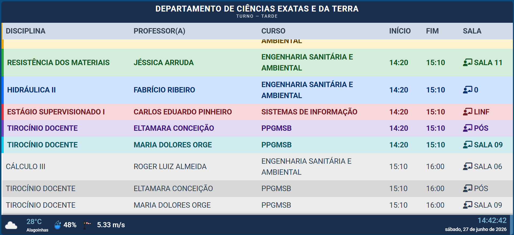

# IROYIN — Institutional Information Display System

[](https://doi.org/10.5281/zenodo.20970621)
[](LICENSE)

**IROYIN** is an open-source web application for institutions (universities, departments, research centers) to display real-time information on public screens — class schedules, news from RSS feeds, open research calls, and weather — managed through a browser-based admin panel.

> *Iroyin* means "news" in Yoruba, reflecting the system's core purpose: keeping communities informed.

---

## Table of Contents

- [Motivation](#motivation)
- [Features](#features)
- [Requirements](#requirements)
- [Installation](#installation)
- [Configuration](#configuration)
- [Using the Kiosk Display](#using-the-kiosk-display)
- [Using the Admin Panel](#using-the-admin-panel)
- [Screenshots](#screenshots)
- [Project Structure](#project-structure)
- [API Endpoints](#api-endpoints)
- [Running Tests](#running-tests)
- [Troubleshooting](#troubleshooting)
- [License](#license)
- [Citation](#citation)
- [Contributing](#contributing)

---

## Motivation

University departments and research centers often struggle to communicate relevant information — class schedules, news, funding opportunities — to students and visitors in a timely and visible way. Physical bulletin boards become outdated quickly, and institutional websites require active navigation.

IROYIN addresses this gap by providing a **zero-interaction display system** designed to run continuously on a monitor or TV screen placed in common areas (hallways, reception desks, labs). Content is managed remotely through a web-based admin panel, requiring no technical knowledge from editors.

The system was originally developed for a Brazilian graduate department and generalized into a reusable platform that any institution can deploy and configure without touching the source code.

---

## Features

- **Class schedule display** — shows the current day's timetable with real-time color highlighting of ongoing classes
- **News panel** — imports articles from RSS feeds with automatic image download and QR code linking to the full article
- **Open calls (Editais)** — typographic panel for active research grants and funding calls from agencies (CAPES, CNPq, FINEP, FAPESB, and others), with countdown to submission deadline and QR code
- **Weather widget** — current conditions via OpenWeatherMap, proxied server-side (API key never exposed to the browser)
- **Role-based admin** — Admin and Editor roles; first-run setup wizard creates the initial account (no hardcoded credentials)
- **Configurable display** — institution name, logo, colors, schedule duration, and news item duration set per-instance
- **Offline detection** — graceful overlay when internet connection is lost
- **Kiosk rotation** — automatic timed cycle: schedule → news → open calls → repeat
- **Night mode** — outside class hours, displays news and open calls continuously instead of an empty schedule

---

## Requirements

| Dependency | Version |
| --- | --- |
| PHP | >= 8.2 |
| Laravel | 12.x |
| MySQL / MariaDB | >= 5.7 / >= 10.4 |
| Composer | >= 2.x |
| Node.js + npm | >= 18 (for asset build only) |
| Web server | Apache 2.4+ or Nginx |

> SQLite is **not** supported. MySQL/MariaDB is required.

---

## Installation

### 1. Clone and install dependencies

```bash
git clone https://github.com/marcosFigueredo/iroyin.git
cd iroyin
composer install --no-dev --optimize-autoloader
npm install && npm run build
```

### 2. Configure environment

```bash
cp .env.example .env
php artisan key:generate
```

Edit `.env` and set at minimum:

```env
APP_NAME="Your Institution Name"
APP_URL=https://your-domain.com

DB_DATABASE=iroyin
DB_USERNAME=your_db_user
DB_PASSWORD=your_db_password
```

### 3. Prepare the database

```bash
php artisan migrate
php artisan db:seed
php artisan storage:link
```

`db:seed` loads default RSS feeds (CAPES, CNPq, FAPESB, MCTI, MEC, SBC, IEEE Spectrum, and others) and pre-registers four Brazilian research funding agencies (CAPES, CNPq, FINEP, FAPESB) with sample open calls for testing.

### 4. Web server

Point your web server document root to the `public/` directory. A sample Apache virtual host:

```apache
<VirtualHost *:80>
    ServerName your-domain.com
    DocumentRoot /var/www/iroyin/public
    <Directory /var/www/iroyin/public>
        AllowOverride All
        Require all granted
    </Directory>
</VirtualHost>
```

Make sure `mod_rewrite` is enabled and `AllowOverride All` is set.

### 5. First run

Open `APP_URL` in a browser. The system redirects to `/setup` where you create the first administrator account. After setup you are taken directly to the institution configuration page.

---

## Configuration

All runtime configuration is managed through the admin panel — no need to edit source files after installation.

### Institution (`/admin/instituicao`)

| Field | Description |
| --- | --- |
| Nome | Full institution name |
| Sigla | Acronym shown in the header |
| Departamento | Department or unit name |
| Cidade / Estado | Location displayed on screen |
| Logo | Image file uploaded for the header |
| Texto do banner | Label shown before news ("NOTÍCIAS", "DESTAQUES", etc.) |

### Display settings (`/admin/configuracoes`)

| Field | Description |
| --- | --- |
| Cidade (clima) | City name for weather lookup |
| Chave API clima | OpenWeatherMap free API key |
| Duração horários | Seconds to show the schedule before switching to news |
| Duração notícia | Seconds each news item stays on screen |
| Cor primária | Accent color applied to badges and highlights |

### OpenWeatherMap API key

Register for a free key at [openweathermap.org](https://openweathermap.org/api). Enter the key in **Configurações → Chave da API de clima**. The key is stored in the database and proxied server-side — it is never sent to the browser.

---

## Using the Kiosk Display

The kiosk display runs at the root URL (`/`) and requires no login. It is designed to run full-screen on a dedicated monitor.

**Opening in full-screen (browser kiosk mode):**

```bash
# Chrome / Chromium
chromium-browser --kiosk https://your-domain.com

# Windows shortcut
chrome.exe --kiosk --app=https://your-domain.com
```

**Display rotation cycle:**

```text
┌─────────────────────────────────┐
│  Class Schedule (configurable)  │  ← 2 min default
└──────────────┬──────────────────┘
               │
               ▼
┌─────────────────────────────────┐
│  News Panel — first half        │  ← 30s per item
└──────────────┬──────────────────┘
               │
               ▼
┌─────────────────────────────────┐
│  Open Calls (Editais)           │  ← 30s per item
└──────────────┬──────────────────┘
               │
               ▼
┌─────────────────────────────────┐
│  Class Schedule again           │
└──────────────┬──────────────────┘
               │
               ▼
┌─────────────────────────────────┐
│  News Panel — second half       │
└──────────────┴──────────────────┘
                     (repeats)
```

Outside class hours the schedule is replaced by a "good night" screen and news/editais loop continuously.

---

## Using the Admin Panel

Access the admin panel at `/admin` (redirects to `/dashboard` after login).

### Managing news (`/admin/noticias`)

**Importing from RSS feeds:**

1. Select a feed from the dropdown and click **Buscar feed** to preview recent articles
2. Click **Buscar Todos** to aggregate articles from all active feeds from the last 7 days
3. Click any article in the list to open the import modal
4. Adjust title, dates, and image as needed, then click **Salvar Notícia**

**Managing feeds** (admin only — expandable panel on the news page):

- Add new RSS feed URLs with a display name
- Toggle feeds active/inactive
- Remove feeds no longer needed

**Adding news manually:**

Click **Nova Notícia** to open the manual entry form (title, link, image upload, date range).

### Managing open calls (`/admin/editais`)

1. Select the funding agency from the dropdown (or add a new agency in the Agências panel)
2. Fill in: title, objective, link to the call, and submission deadline
3. Click **Cadastrar edital**

The kiosk displays active calls ordered by deadline (soonest first). Calls past their deadline are shown as "ENCERRADO" and can be manually deactivated or deleted.

**Managing agencies** (expandable panel):

Each agency has: full name, acronym, brand color (used as badge background on screen), RSS news feed URL, and editorial call page URL.

### Managing class schedules (`/admin/semestres`)

1. Create a semester and activate it
2. Import or manually enter class entries (subject, professor, course, room, start/end time)
3. Only the active semester is shown on the kiosk

### User management (`/admin/users`) — admin only

| Role | Permissions |
| --- | --- |
| Admin | Full access: all content + system settings, feeds, users |
| Editor | Content only: news, editais, schedules |

New users are created by the admin with a temporary password. There is no public registration.

---

## Screenshots

> Screenshots show IROYIN running at 1920×1080.

**Class schedule panel** — real-time highlighting of ongoing classes, weather widget, and clock in the footer:



*Additional screenshots (news panel, open calls, admin panel) can be added to `docs/screenshots/`.*

---

## Project Structure

```text
├── app/
│   ├── Http/
│   │   ├── Controllers/
│   │   │   ├── Admin/          # Admin panel controllers
│   │   │   ├── Api/            # JSON API endpoints (consumed by kiosk)
│   │   │   └── SetupController.php
│   │   └── Middleware/
│   │       ├── AdminMiddleware.php
│   │       └── EnsureSetupComplete.php
│   └── Models/
│       ├── Agencia.php
│       ├── Configuracao.php
│       ├── Edital.php
│       ├── Feed.php
│       ├── Horario.php
│       ├── Instituicao.php
│       ├── Noticia.php
│       └── Semestre.php
├── database/
│   ├── migrations/
│   └── seeders/DatabaseSeeder.php
├── public/
│   ├── index.html              # Kiosk display (no auth required)
│   └── assets/
│       ├── css/style.css
│       └── js/
│           ├── config.js       # Fetches /api/config, resolves _configReady promise
│           ├── kiosk.js        # Rotation cycle orchestrator
│           ├── editais.js      # Open calls panel renderer
│           ├── newsDisplay.js  # News panel renderer
│           ├── newsBanner.js   # Transition banner animation
│           ├── classTime.js    # Schedule table + real-time highlighting
│           ├── weather.js      # Weather widget (calls /api/clima)
│           ├── dataHora.js     # Clock and date display
│           ├── internetCheck.js
│           └── refresh.js      # Auto page reload
└── resources/views/
    ├── admin/
    │   ├── noticias/
    │   ├── editais/
    │   ├── semestres/
    │   ├── horarios/
    │   ├── users/
    │   ├── feeds/
    │   ├── instituicao/
    │   └── configuracoes/
    └── layouts/
        └── app.blade.php
```

---

## API Endpoints

All endpoints are public (no authentication required) and consumed by the kiosk display.

| Endpoint | Method | Description |
| --- | --- | --- |
| `/api/config` | GET | Institution settings and display configuration |
| `/api/horarios` | GET | Today's class schedule (active semester) |
| `/api/noticias` | GET | Active news items (within date range) |
| `/api/editais` | GET | Active open calls ordered by deadline |
| `/api/clima` | GET | Current weather proxied from OpenWeatherMap |

`/api/clima` returns HTTP 204 if no API key or city is configured — the weather widget hides itself automatically.

---

## Running Tests

```bash
php artisan test
```

All 23 tests should pass on a fresh install. Tests cover authentication, setup wizard, middleware behavior, and profile management.

---

## Troubleshooting

### Kiosk shows blank screen or spinner

- Check that the web server is running and `APP_URL` in `.env` matches the actual URL
- Open browser console — if `/api/config` returns a 500 error, check `storage/logs/laravel.log`
- Make sure `php artisan storage:link` was run

### Schedule is empty

- Confirm a semester is created and set as **active** in `/admin/semestres`
- Check that schedule entries exist for today's day of the week

### News feeds return no results

- Some RSS feeds may be temporarily unavailable or have changed URL — test the URL directly in a browser
- SSL errors on feeds: ensure the server has a valid CA bundle (`ca-certificates` package on Linux)

### Weather widget not showing

- Add a valid OpenWeatherMap API key in `/admin/configuracoes`
- The city name must match OpenWeatherMap's naming (e.g., `Salvador,BR`)
- Check `/api/clima` directly — if it returns 204, the key or city is not configured

### `/setup` keeps redirecting even after creating the admin

- Clear the application cache: `php artisan cache:clear`
- Verify the `users` table was created: `php artisan migrate:status`

### Uploaded images not displaying

- Run `php artisan storage:link` to create the `public/storage` symlink
- Check that `storage/app/public/` is writable by the web server user

### 403 / 404 on Apache

- Ensure `mod_rewrite` is enabled: `sudo a2enmod rewrite`
- Confirm `AllowOverride All` is set for the `public/` directory
- Check that `.htaccess` is present in `public/`

---

## License

MIT — see [LICENSE](LICENSE).

---

## Citation

If you use IROYIN in academic work, please cite:

> Figueredo, M. (2026). IROYIN: An open-source institutional information display system for universities and research departments. *SoftwareX*. [https://doi.org/10.5281/zenodo.20970621](https://doi.org/10.5281/zenodo.20970621)

---

## Contributing

Pull requests are welcome. For major changes, please open an issue first to discuss what you would like to change. Please run `php artisan test` before submitting a PR.
